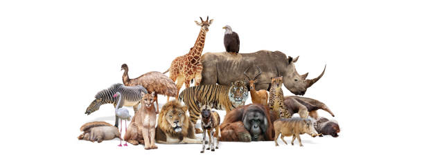

# taxonomy_of_living_organisms_using_self_organizing_map

<i>This is an SOM, an unsupervised algorithm, project done in 2012. The paper was published in 2020.</i>

The Self Organizing Map (SOM) is an unsupervised network algorithm that projects high dimensional data into 
low dimensional maps. The projection preserves the topology of the data so that similar data items are mapped to nearby 
locations on the map. The algorithm has been so popular because of its application in Computer Science and other areas; it has 
been applied in speech recognition, pattern identification, control engineering, earthquake detection et al. This research aimed 
to apply the SOM in the taxonomy of living organisms using 46 attributes. 68 animals from 6 phyla were considered and 46 
attributes were used detailing their physical features, physiological features, evolution, adaptation, habitat et al. The features 
extracted were converted to 0s and 1s for the SOM algorithm to process. The result shows 96.569% accuracy of the SOM’s 
classification but better accuracy can be obtained if the SOM had processed the data for about 1000 iterations. This research 
revealed that SOM is a veritable tool or algorithm that can be used to classify living organisms. This research will help 
taxonomists, biologists and students who spend much time in classifying living organism and it will be of help to researchers 
who want to explore the SOM algorithm as a solution to taxonomy of living organisms. The SOM will ease taxonomy and will 
help to minimize the stress and time involved in classifying thousands of living organisms.

<i>Read the research paper here: https://www.sciencepublishinggroup.com/article/10.11648/j.ajai.20200402.12</i>

